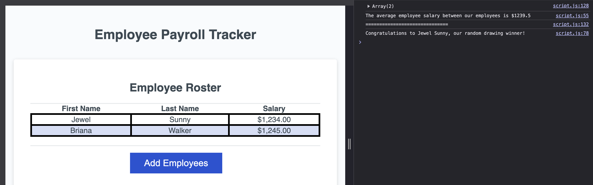

# Employee-payroll-tracker
This employee payroll tracker records data such as individual employee salary and average salary between all employess of a company. In addition, the tracker can randomly select an employee for whatever purpose maybe needed. 

## Description
This employee payroll tracker was created for companies to easily access and track payment information for their employees.

## Technologies Used
Front-End technologies such as HTML, CSS, and JavaScript

## Website
https://jewelsunny1.github.io/employee-payroll-tracker/

## Screenshots
Finished webpage should look like this:

## Credits
How to pick random elements from an array - javatpoint. www.javatpoint.com. (n.d.). https://www.javatpoint.com/how-to-pick-random-elements-from-an-array 

